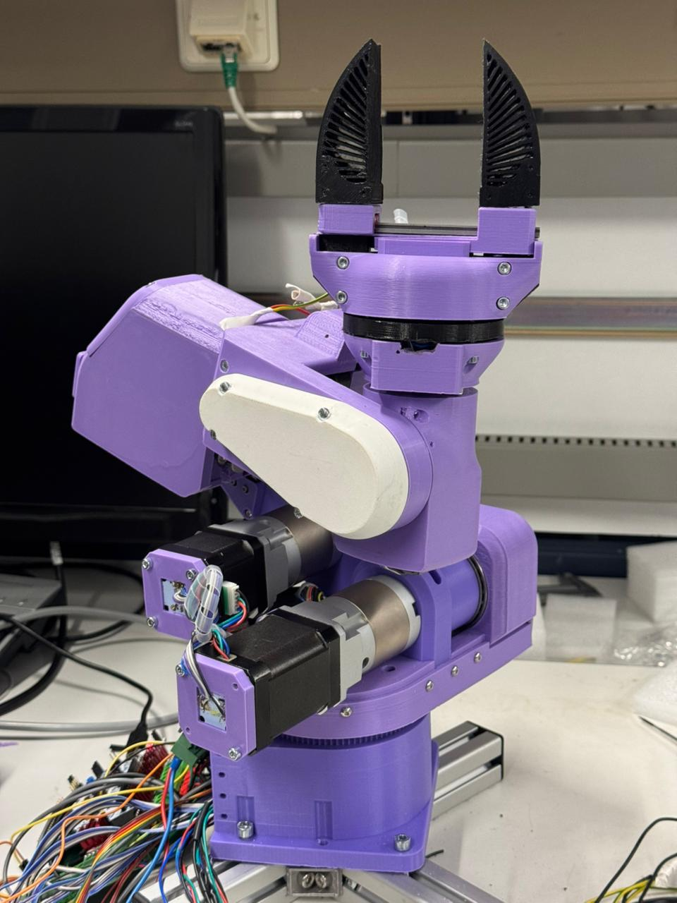
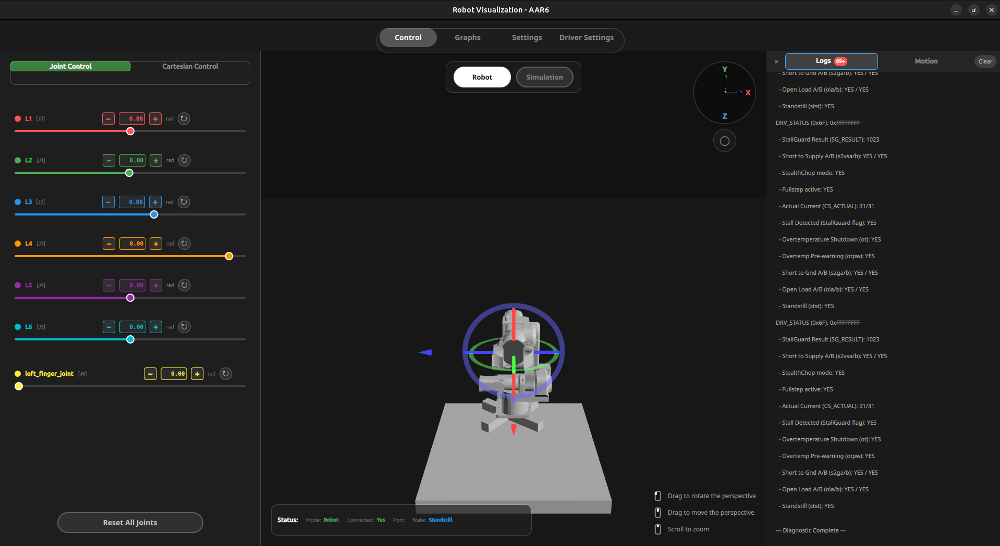
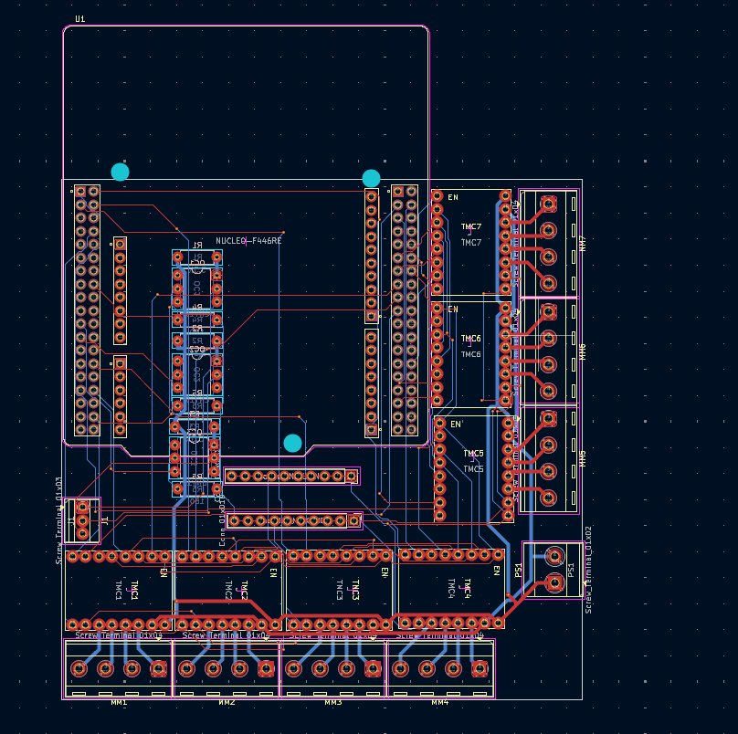

# AR6: 6-DOF Robotic Manipulator

AR6 is a  6-DOF (Degrees of Freedom) desktop robotic arm ecosystem. This project integrates motion control, custom hardware design, and interactive 3D visualization into a unified platform. It is based on the open-source **PAROL6** design by Source Robotics, heavily modified with custom electronics and a robust QP-based differential controller.

 

## 📂 Project Structure

This repository is organized as a monorepo containing all sub-systems of the AR6 robot:

### 1. [MCU Firmware](mcu_firmware/)
The low-level "brain" of the robot, running on an **STM32F446** microcontroller.
- **Real-Time Control**: Implements a 20kHz motion engine for smooth step generation.
- **S-Curve Profiles**: Uses 7-segment S-curve trajectories to minimize jerk and vibrations.
- **Driver Interface**: Communicates with **TMC5160** stepper drivers via SPI.
- **Telemetry**: Streams high-frequency joint states and system health to the host PC.

### 2. [URDF Standalone Controller](Robot_controller/)

The advanced kinematic engine and 3D visualization suite.
- **Kinematics Engine**: High-performance Forward and Inverse Kinematics (FK/IK) implementation.
- **Differential QP Controller**: A singularity-robust solver using Selective Damped Least Squares (SDLS) and Quadratic Programming (OSQP).
- **3D Visualization**: A Qt/QML based interface for real-time monitoring, gizmo-driven movement, and simulator functionality.
- **Collision Checking**: Integrated environment awareness for safe motion planning.

### 3. [Control Board](control_board/)

Custom PCB design (KiCad) that integrates all electronic components.
- **Motor Control**: Supports 7× TMC5160 drivers (6 joints + 1 gripper).
- **Sensor Integration**: Interfaces for AS5600 magnetic encoders and limit switches.
- **Connectivity**: High-speed USB tracking and power distribution logic.

### 4. [ROS 2 Workspace](Robot_ros2_ws/)
Integration layer for the Robot Operating System (ROS 2 Jazzy).
- **Environment**: Containerized ROS 2 development via Docker.
- **Bridging**: Scripts to bridge URDF standalone commands to standard ROS 2 topics.
- **MoveIt Support**: Configuration files for advanced trajectory planning.

### 5. [Documentation](documentation/)
Technical reports, schematics, and academic documentation.
- **Technical Report**: Detailed LaTeX documentation covering mathematics, hardware specs, and software architecture.
- **Schematics**: PDF and image exports of the electrical design.

---

## 🚀 Key Features

- **Singularity Robustness**: Graceful handling of wrist, shoulder, and elbow singularities using adaptive damping.
- **Industrial Precision**: Closed-loop feedback via magnetic encoders for high-accuracy positioning.
- **Interactive Control**: Move the robot via 3D gizmos, joint sliders, or direct Cartesian input.
- **Optimized Communication**: 921,600 baud DMA-based serial link for low-latency host-to-MCU coordination.

---

## 🛠️ Components Overview

| Component | Technology | Detail |
| :--- | :--- | :--- |
| **Microcontroller** | STM32F446RET6 | ARM Cortex-M4 @ 180MHz |
| **Motor Drivers** | TMC5160 | 32 microsteps, StallGuard support |
| **GUI Framework** | Qt 6 / QML | Hardware-accelerated 3D rendering |
| **Optimization** | OSQP | Convex Quadratic Programming solver |
| **Communication** | USB-CDC | Custom binary protocol with CRC |

---

## 📜 Documentation & Attribution
- **Mechanical Design**: [PAROL6 by Source Robotics](https://source-robotics.github.io/PAROL-docs/)
- **Core Libraries**:
  - [EAIK (Eigen-based Analytical Inverse Kinematics)](https://github.com/OstermD/EAIK) - Primary analytical seeder for IK.
  - [OSQP (Operator Splitting QP Solver)](https://github.com/osqp) - Numerical optimization for differential control.
  - [FCL (Flexible Collision Library)](https://github.com/flexible-collision-library/fcl) - Real-time collision checking and environment awareness.
